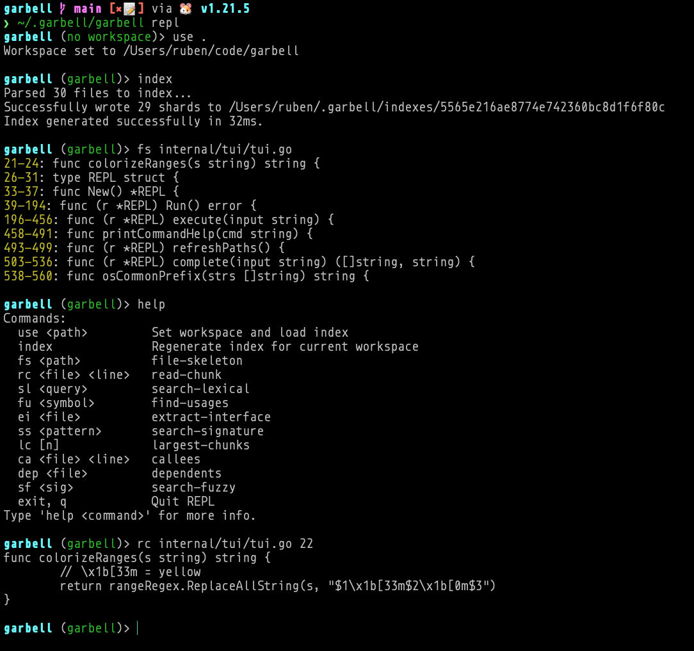

<div align="center">


# garbell


_Progressive disclosure for code exploration._

</div>

> **garbell** (_n., Catalan_) — A sieve; a mesh tool used to separate fine matter from coarse, or to strain impurities from a substance. From Old Occitan _garbell_, related to Arabic _ghirbāl_. Used in mining to separate gold from sediment.

A local, daemonless CLI tool that gives LLM agents structured access to codebases — without reading whole files into context.

---

## The problem it solves

An agent exploring an unfamiliar codebase will reach for files. But files are the wrong unit. A single file might be 800 lines; the agent cares about one function. Reading the whole thing costs context that cannot be recovered, repeated across ten files before the feature is understood.

> When I hit an unfamiliar file, my instinct is to read the whole thing. That's expensive, and I usually only needed one function out of it.
>
> — _Claude Sonnet 4.6, during development of this tool_

The right unit is the **chunk** — a function, a class, a heading section — and the right strategy is **progressive disclosure**: expose structure first, let the agent zoom into only what matters.

`garbell` enforces this pattern by design:

1. **Orient** — `file-skeleton` returns every function signature and its line range, without bodies. One call, near-zero context cost.
2. **Zoom** — `read-chunk <file> <line>` returns exactly the chunk enclosing that line. The agent pays only for what it reads.
3. **Search** — `search-lexical <query>` uses ripgrep under the hood but returns a **compact chunk list** (signature + line range per match) rather than raw grep output. Drill into any entry with `read-chunk`.

The same principle applies when results would be too large: instead of truncating, `garbell` returns a directory-grouped summary — symbol counts per folder, file lists — so the agent knows exactly where to drill next rather than getting a wall of partial output. Progressive disclosure is the name of the game, after all.

This is an evolution of the RLM-like approach I explored in [cercle](https://github.com/rberenguel/cercle). Cercle uses SQLite with BM25 similarity fuzziness and GloVe averaging to provide semantic search, all with a persistent daemon. It sounds cool, it is cool, but there are too many moving pieces.

---

## Commands

Each command answers a distinct question:

| Question                             | Command                      |
| ------------------------------------ | ---------------------------- |
| _What exists and where?_             | `file-skeleton <path\|dir>`  |
| _What does this do?_                 | `read-chunk <file> <line>`   |
| _What is around this line?_          | `peek <file> <line> [r]`     |
| _Where is X mentioned?_              | `search-lexical <query>`     |
| _Who calls this?_                    | `find-usages <symbol>`       |
| _What does this expose?_             | `extract-interface <file>`   |
| _What has this shape/signature?_     | `search-signature <pattern>` |
| _Where is the complexity?_           | `largest-chunks [n]`         |
| _What does this call?_               | `callees <file> <line>`      |
| _What imports this?_                 | `dependents <file>`          |
| _What is this called, roughly?_      | `search-fuzzy <sig>`         |
| _What is conceptually related to X?_ | `search-related <query>`     |
| _Human interactive exploration?_     | `repl`                       |

Full reference: [`REFERENCE.md`](REFERENCE.md).

---

## Interactive exploration

When exploring a new codebase natively, running `garbell repl` gives you (you = human) a snappy Read-Eval-Print Loop. The REPL includes history (up/down arrow keys), cursor navigation, and lightning-fast tab completion for both commands and file paths using the local index. You can see what the LLM sees.



---

## "Evaluation"

A real-world test on a ~60-file, ~134K-line JavaScript codebase ([destrier](https://github.com/rberenguel/destrier)). The agent was asked to implement a full two-player versus mode from scratch. Context window remaining was measured at two natural milestones:

| Approach                        | After exploration | After planning |
| :------------------------------ | :---------------: | :------------: |
| **garbell**                     |        59%        |      47%       |
| **Vanilla** (native file reads) |        41%        |      38%       |

~20% more context preserved heading into the design phase. The gap comes almost entirely from `file-skeleton` + `read-chunk`: instead of reading whole files, the agent reads signatures first and pays for only the chunks it needs.

> `file-skeleton` was the killer feature. Getting just function signatures and line ranges for a 1300-line file in one call, then drilling in with `read-chunk`, was much more efficient than reading whole files. `search-lexical` returning full function bodies around matches meant I rarely needed follow-up reads. The `find-usages` → `file-skeleton` → `read-chunk` workflow felt natural and fast.
>
> **Bottom line:** For a codebase of this size, it probably saved 30–40% context vs naive file reading.
>
> — _Claude Sonnet 4.6, post-task assessment_

---

## Architecture

`garbell` is a single statically-linked binary with no runtime dependencies beyond `rg` (ripgrep).

### Indexing

`garbell index` walks the project (respecting `.gitignore`) and parses each source file with a language-specific heuristic parser — regex + brace/indent counting, no Tree-sitter, no CGO. Each function, class, or section becomes a **chunk**: a file path, a start line, an end line, and a signature string.

Chunks are written as sharded JSON into `~/.garbell/indexes/<workspace-hash>/`. Re-indexing is instant — sub-second on most projects.

### Search

Lexical search delegates to `rg` for the raw match, then looks up the surrounding chunk in the index to return the full body. Fuzzy search uses pure-Go Levenshtein distance against the signature vocabulary. Everything else reads directly from the index shards — no file I/O.

Semantic search is a layer on top of lexical search. During indexing, `garbell` builds a repository-specific thesaurus using Positive Pointwise Mutual Information (PPMI): it tracks how often pairs of tokens co-occur across the codebase and distils the top 5 related terms for each. At query time, `search-related` tokenises the query, expands it with those related terms, and passes the resulting alternation regex to `search-lexical`. No embeddings, no model, no network — the thesaurus is a small `ppmi.json` file alongside the chunk shards.

### Progressive disclosure threshold

All commands that can return large outputs check a line threshold (default: 500, override with `GARBELL_MAX_LINES=n`). When output would exceed it, the command returns a directory-grouped summary with symbol counts and file lists, so the agent can narrow its query or drill into a specific location.

---

## Supported "languages"

| Extension                            | Parser                     | Extracts                                        |
| ------------------------------------ | -------------------------- | ----------------------------------------------- |
| `.go`                                | Heuristic (brace counting) | `func`, `type`                                  |
| `.py`                                | Heuristic (indentation)    | `def`, `class`, `async def`                     |
| `.js` `.ts` `.jsx` `.tsx`            | Heuristic (brace stack)    | `function`, `class`, arrow functions            |
| `.c` `.cpp` `.cc` `.cxx` `.h` `.hpp` | Heuristic (brace counting) | function definitions, `class`, `struct`         |
| `.css`                               | Heuristic (brace counting) | rules/selectors                                 |
| `.html` `.htm`                       | Tag matching               | `<script>`, `<style>`, `<main>`, `<div id=...>` |
| `.md` `.mdx`                         | Heading-based              | ATX headings — each section is one chunk        |
| `.proto`                             | Heuristic (brace counting) | `message`, `service`, `enum`                    |

Files with unrecognized extensions are skipped. Files of supported types that produce no chunks and are longer than 50 lines fall back to overlapping 50-line sliding windows.

---

## Quick start

**Requirements:** Go 1.21+, `rg` (ripgrep) in PATH.

### Install

```bash
task build    # compiles and installs the binary to ~/.garbell/garbell
task install  # installs the agent skill to ~/.claude/skills/garbell and ~/.gemini/skills/garbell
```

Both steps are needed. `task build` puts the binary in place; `task install` copies the skill manifest so Claude Code and gemini-cli can invoke it.

### Use

```bash
# Index a project
cd /path/to/project
~/.garbell/garbell index

# Explore
~/.garbell/garbell file-skeleton src/
~/.garbell/garbell search-lexical "error handling"
~/.garbell/garbell read-chunk src/auth/login.go 25
```

In practice, agents invoke `garbell` through the skill — they never need to know the binary path.

---

## Known limitations / future improvements

- **Module-scope lines** — `read-chunk` returns an error for lines not inside a function or class (imports, top-level constants). Use `extract-interface` for the public surface, or read the file directly.
- **Missing languages** — Rust, Java, Ruby, Swift are not currently supported.
- **Brace-in-strings** — Go, JS, C++ parsers count raw `{`/`}` characters; string literals with braces can miscount chunk boundaries.

---

## Acknowledgements

- [ripgrep](https://github.com/BurntSushi/ripgrep) — the engine behind lexical search and file discovery.
- [Claude](https://claude.ai) — primary client and co-author; wrote most of this, used it on itself, noticed the context savings.
- [Antigravity](https://antigravity.google/) — co-author of the initial [cercle](https://github.com/rberenguel/cercle) architecture, wrote the REPL here.
- [Gemini](https://gemini.google.com) — contributed to the original [cercle](https://github.com/rberenguel/cercle) architecture this tool grew out of. Icon, too.
